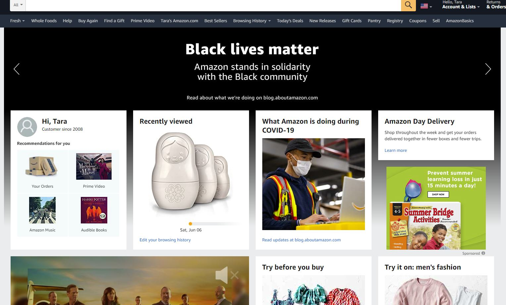
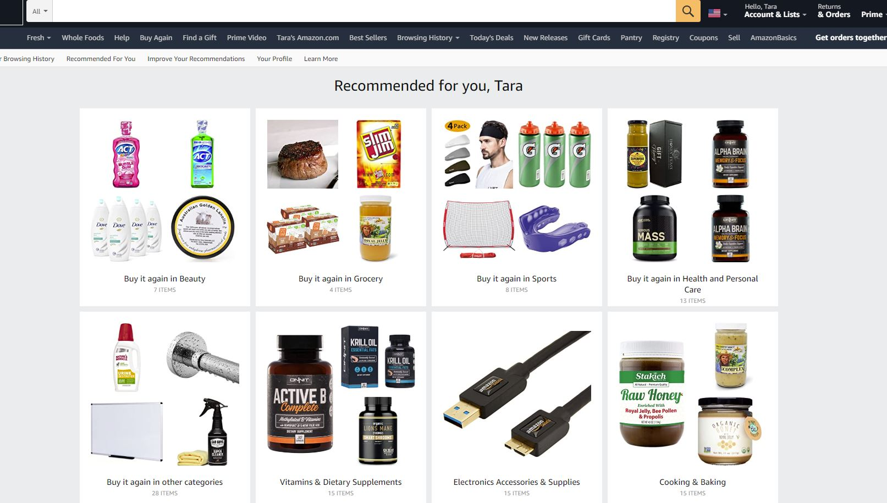

```{r setup, include=FALSE}
knitr::opts_chunk$set(echo = TRUE)
```


## Amazon Recommendation System

### Introduction

With the rise of Direct to Consumer practice along with the First Party Data Collection in the recent years, ecommerce became one of the biggest priorities for most brands and organizations. Ecommerce departments within organizations come up with new and innovative methods such as increasing app or web user experience for conversion rather than engagement and personalized product recommendations. If you visit one of those Christmas flee markets, you might notice the booths that does personalized, and customized Christmas ornaments does very well. One way to get mass customization in e-commerce is the use of recommender systems. 

In this article we are going to look at Amazon recommender system which could be helping their sales in couple different ways. Unique visitors might come to the site and leave without even become a shopper where they select an item and add to cart. Recommender system can help guide the customer to the product and eventually to the purchase funnel. It also can increase cross sell opportunities by suggesting a product that goes with another product user already purchased or in process of purchasing. 

Based on my research and understanding, out of the box recommendation systems are not able to scale Amazon’s database and the current recommender system is developed by the Amazon team. (Traditional Collaborative filtering, cluster models, search based models and etc…)

### Recommender Systems

Before we review what Amazon uses currently in terms of recommendation engines. Let’s briefly look at the basic types of recommender systems. 
-	Simple Recommenders leverages the basic idea of;  if something is popular and has high popularity the customer’s might like that product.
-	Content-based Recommenders leverages the idea of; engine recommends a product to customer x if similar to or previous products are rated highly by customer x.
-	Collaborative filtering leverages the collected preferences of the consumer  and provides products based on these preferences. 

###Amazon Recommender System

Amazon uses Item to Item Collaborative Filtering. When we look at the traditional collaborative Filtering, we are looking at solely the past interactions recorded between users and products to get to a recommendation. The consumer’s purchase records, interactions and etc… are stored in “interaction matrix”  For example matrix will have user gives ratings to Amazon, spends time on a product detail page, clicks on CTA on Product Detail Page (Add to Cart) and etc….  

Traditional Collaborative filtering algorithms is divided into two categories  Memory based and Model based. Memory based approach is based on nearest neighbors and model based approach creates a logic model that assumes an explanation of consumer-product interactions. 

Amazon uses its recommendation engines as targeting marketing tool in email campaigns or in its website. The website homepage uses the engine;



And in “Your Recommendations” link;



Even the impulse buy items that are in checkout line are based on the recommendation engine.


Amazon’s item to item collaborative filtering matches each of the consumer’s purchased and rated products in the past to similar products and then combines those items into the recommendation list. (Instead of matching the consumer to similar consumers)

Amazon algorithm builds similar items table by aggregating the products that consumer purchase together. Basically, each vector corresponds to a product rather than a consumer. 


### Conclusion:

Based on my experience, I find the recommendations from Amazon accurate but repetitive. Since they are completely based on the previous bundled purchases, the recommendations are the products I purchased in the past. Understandably the scalability is very important to Amazon due to the its over 30 million customers and that is probability one of the reasons the item to item collaborative filtering method uses offline computations. (As I understand, traditional collaborative filtering does little or no offline computation), however the method does not provide any recommendation that is outside the box. (for example; trending and popular products in the market). Simple example, right before summer, trampolines are trending for consumers with kids ages between 4-12. I never purchased a trampoline, Amazon does not recommend that to me and now I decided to purchase one and there is not one in stock. 

References:
http://www.cs.umd.edu/~samir/498/Amazon-Recommendations.pdf
http://rejoiner.com/resources/amazon-recommendations-secret-selling-online/
https://towardsdatascience.com/recommender-systems-in-practice-cef9033bb23a
https://towardsdatascience.com/introduction-to-recommender-systems-6c66cf15ada#:~:text=recommendation%20algorithms%20can%20be%20divided,information%20about%20users%20and%2For


## Attacks on Recommender System 

### Introduction:

Article “Wisdom of the crowd? IMDb users gang up on Christian Bale’s new movie before it even opens” is an interesting read. User generated data has always been tricky and usually there are moderator organizations or departments that checks the validity of this data. Users can manipulate recommender systems by adding their own ratings or comments which can lead to decreasing a rank of a product or content. They can do that to either manipulate the users or possibly sabotage the competitive products.

Below are some types of attacks

1-	Profile Insertion Attack: Push attack increases the prediction value of a target item. Nuke Attack, decrease the prediction value of a target item. Makes the recommender system unusable. 
2-	The Random Attack. Take a random value for filler items, high/low ratings for target items.
3-	Average Attack: Use the individual item’s rating average for filler items. Basically, attack profiles are created that the ratings for filler items are average rating for that item across all the users in database. 
4-	Bandwagon Attack: Exploits additional information about the community ratings. The attack profiles are created with high rating values from the database of ratings of items.
5-	Segment Attack: Push for a specific item. For example, create a bot for similar segment items or users to push within a group of items or users.

Below are some countermeasures:

-	Increase security against profile injections such as adding Captchas
-	Monitor items to detect groups of users who collaborate with push items

I personally didn’t experience an attack on a recommender system that I was involved with in my work experience, however it seems to me some of the Amazon reviews are fake and they are there to manipulate the ratings of a product. On another note; there are many third party integrations that collects consumer ratings on products for major brands. Here is an example ( https://www.benefiber.com/fiber-supplement-products/benefiber-healthy-balance/ ) . These third party organizations actually moderate the user generated content whether it is a review or rating. They also provide review syndication with the same products in other channels such as Amazon. Here is an example: ( same product here: https://www.amazon.com/Benefiber-Healthy-Balance-Prebiotic-Unflavored/dp/B07PKVKZ8M/ref=sr_1_3?dchild=1&keywords=benefiber+healthy+balance&qid=1591824580&sr=8-3 ) They monitor the attacks such as sudden changes in average ratings and report to the brand accordingly. 

Reference: https://www.math.uci.edu/icamp/courses/math77b/lecture_12w/pdfs/Chapter%2009%20-%20Attacks%20on%20collaborative%20recommender%20systems.pdf 


